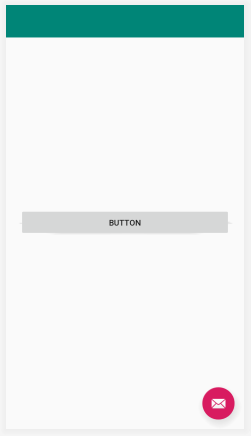
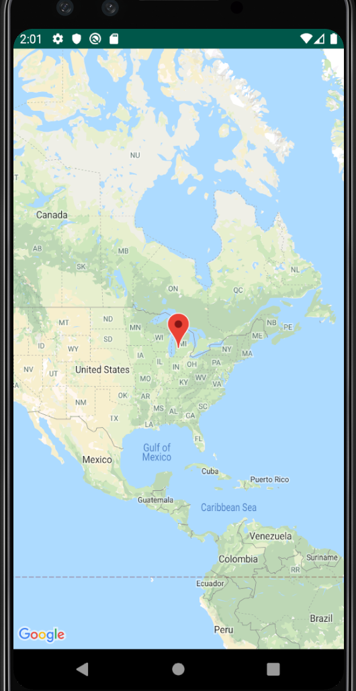
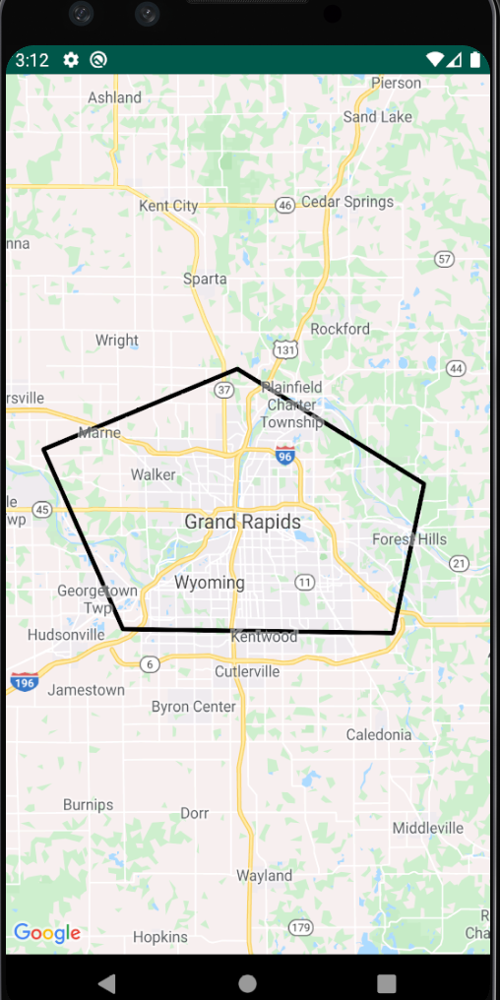

## Setup

To begin developing for the app we must first get an IDE to house our code. Android Studio is a free IDE developed and maintained by google that can be downloaded here: Download Here! Next, we are going to need a key for the Maps SDK provided by Google. This can also be found here, while on the page in the top right corner it will say get started. Click this button, Google will then ask you to sign in. After successfully signing in a pop up will appear titled “Enable Google Maps Platform”, you then pick the API’s we will need. In this case choose Maps, then choose a project name. Google will then route you to a page enabling a billing account, fill in this information. Next you should be faced with a home screen, making sure that your project is selected from the drop down menu in the toolbar. We then click on “APIs & Services” -> “Credentials”, then create credentials. Google will pop up another dialog box, click on the API key selection. This should give you your own personal API key. Then we make our way to “APIs & Services” -> “Library”, sometimes the Maps SDK API has issues so you should clarify that it is enabled and ready to use.

### Creating the application

Now we can load Android Studio and start a new project. Right away you will be asked which activity you would like to create.  For thsi we’ll keep it simple and start with a basic activity. Name your activity, package name, where you want it to be saved, and the language you are coding in. For the purpose of this tutorial, just leave all of these as the default. Your project has now been created. In the top left corner of Android Studio there’s the option “File”. Follow these steps to create a new Google Maps Activity, File -> New -> Google -> Google Maps Activity. A new pop up will appear allowing you to choose the name and other aspects of your activity. Once finished, a new file titled google_maps_api.xml can be found by going to: app -> res -> values -> google_maps_api.xml. Once here you should see a string saying: 
```js
<string name="google_maps_key" templateMergeStrategy="preserve" 
 translatable="false">YOUR KEY</string>
```

### Syncing with google maps

The API key you received from Google should be copied into the section “YOUR KEY”. Next we will go to the AndroidManifest.xml file to copy and paste some code that will give your device permission to access current locations, the internet, and write to external storage. This code is found here: 
```
<uses-permission android:name="android.permission.ACCESS_FINE_LOCATION" />
<uses-permission android:name="android.permission.ACCESS_COARSE_LOCATION"/>
<uses-permission android:name="android.permission.INTERNET" />
<uses-permission android:name="android.permission.WRITE_EXTERNAL_STORAGE" />
```

#### Ready to start

We should now have our activities all set to start our coding. On our content_main.xml file we are able to see a textView that hold the value “Hello World!” we can now delete this. Instead we will add a button that will help us make an intent to the maps activity. To do so, search for button in the activities and drag one outt to the interface. Make sure to give this button and id of toMap so that we can reference it later. Next we will add the following code to the MainActivity.java file. 
```
public class MainActivity extends AppCompatActivity {

   public static final int selection = 1;

   @Override
   protected void onCreate(Bundle savedInstanceState) {
       super.onCreate(savedInstanceState);
       setContentView(R.layout.activity_main);
       Button toMap = findViewById(R.id.toMap);

       toMap.setOnClickListener(e-> {
                   Intent intent = new Intent(MainActivity.this, MapsActivity.class);
                   startActivityForResult(intent, selection);
       });
   }
}
```
This code gives us access to the button we created on the main screen.  The setOnClickListener is alowing us to execture the given code when the button is pressed. In our case we are creating an intent to transition to a maps activity that we have yet to create. The line of code that mentions ```findViewByID(R.id.toMap)``` is connecting the button we created previously in content_main.xml file to our java code. Your content_main.xml file should now look like this:



Within the MapsActivity.java file we can set the destination of a marker on our map, for this instance we chose the city of Grand Rapids for our marker point which can be seen here:

```
@Override
public void onMapReady(GoogleMap googleMap) {
   mMap = googleMap;

   // Add a marker in Grand Rapids and move the camera
   LatLng GrandRapids = new LatLng(42.9634, -85.6681);
   mMap.addMarker(new MarkerOptions().position(GrandRapids).title("Marker in Grand Rapids, MI"));
   mMap.moveCamera(CameraUpdateFactory.newLatLng(GrandRapids));
}
```

###### Give it a test

We can finally test the code to make sure the map is working correctly, we can do this by just running the emulator. 




### Adding Polylines
Now to actually implement polylines we are going to have to change up the code within the MapsActivity.java file. We can start by implementing different listeners into the class by using this code:
```
public class MapsActivity extends FragmentActivity implements OnMapReadyCallback,GoogleMap.OnPolylineClickListener,GoogleMap.OnPolygonClickListener{
```

With this code you will be asked to implement methods otherwise you will receive errors.  To do this hover over class signature, click the red light bulb that appears, and select impliment methods. Next we will need to handle the onCreate method. For this we will need to set a content view which renders the map and add a notification for when the map is ready to be used. This can all be seen and copied from here:
```
@Override
protected void onCreate(Bundle savedInstanceState) {
   super.onCreate(savedInstanceState);
   setContentView(R.layout.activity_maps);
   SupportMapFragment mapFragment = (SupportMapFragment) getSupportFragmentManager()
           .findFragmentById(R.id.map);
   mapFragment.getMapAsync(this);
}
```
Finally, to add the actual polylines to the map we will need to get latitude and longitudinal coordinates for our points. For this example, the points chosen were randomly picked as to surround Grand Rapids with the polylines. All of the next code will be housed within the “onMapReady(GoogleMap googleMap)” method as shown here:
```
@Override
public void onMapReady(GoogleMap googleMap) {.
   Polyline polyline1 = googleMap.addPolyline(new PolylineOptions()
           .clickable(true)
           .add(
                   new LatLng(43.086806, -85.675232),
                   new LatLng(43.021329, -85.891182),
                   new LatLng(42.874761, -85.802613),
                   new LatLng(42.871623, -85.501837),
                   new LatLng(42.993224, -85.467274),
                   new LatLng(43.086806, -85.675232)));

   googleMap.moveCamera(CameraUpdateFactory.newLatLngZoom(new LatLng(43.086806, -85.675232), 10));

   googleMap.setOnPolylineClickListener(this);
   googleMap.setOnPolygonClickListener(this);
}
```
This code allows the user to create a polyline that house multiple waypoints. There is no limit to the number of waypoints that you can create. After choosing the waypoints we will need to update the camera as to find where our polyline actually resides. This is done by using the CameraUpdateFactory call. We can then pick a point on the map that is close to our polyline as well as our zoom factor. For this instance, a zoom factor of 10 gets close enough to see the roads of Grand Rapids but also far enough to see the entire polyline. Let’s run our new MapsActivity and see what it looks like. 



If our steps were followed completely, your app should look like the image above. Polylines are very versatile in how they can be implemented, perhaps you want to make a flight path tracking app and want to see how flights are going to be routed, or you could use polylines for basic street directions as well. By further research a developer can find new ways to implement polylines for different interesting applications.
